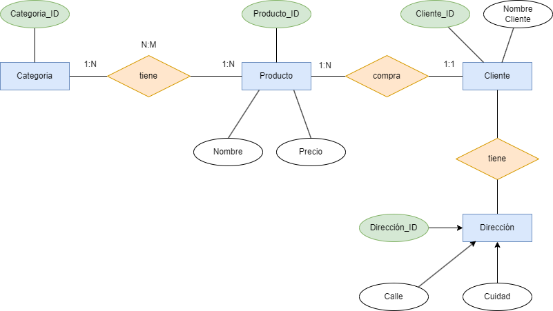
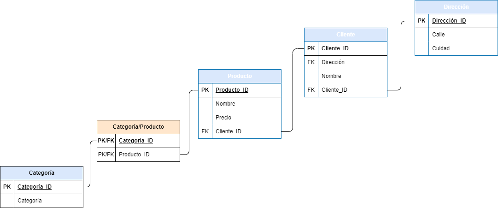

La siguiente tabla muestra la información de una tienda con sus productos.

# Base de Datos No Normalizada: Tienda

| ProductoID | Nombre          | Categorias                  | Precio | ClienteID | NombreCliente | DireccionesEnvio                    |
|------------|-----------------|-----------------------------|--------|-----------|---------------|-------------------------------------|
| 1          | Laptop HP       | Electrónicos, Informática   | 800    | 101       | Juan          | Calle 1, Ciudad A / Calle 2, Ciudad A |
| 2          | Camiseta Nike    | Ropa, Deportes              | 30     | 102       | María         | Calle 3, Ciudad B                    |
| 3          | Libro "Dune"     | Libros, Ciencia Ficción     | 20     | 101       | Juan          | Calle 1, Ciudad A                     |

Se pide:

## Verifica y transforma a __1FN__ justificando la respuesta.

### Se le Aplica la 1FN a la tabla:

| ProductoID | Nombre          | Categorias       | Precio | ClienteID| NombreCliente | Calle   | Cuidad    |
|------------|-----------------|------------------|--------|----------|---------------|---------|-----------|
| 1          | Laptop HP       | Electrónicos     | 800    | 101      | Juan          | Calle 1 | Ciudad A  |
| 1          | Laptop HP       | Informática      | 800    | 101      | Juan          | Calle 2 | Ciudad A  |
| 2          | Camiseta Nike   | Ropa             | 30     | 102      | María         | Calle 3 | Ciudad B  |
| 2          | Camiseta Nike   | Deportes         | 30     | 102      | María         | Calle 3 | Ciudad B  |
| 3          | Libro "Dune"    | Libros           | 20     | 101      | Juan          | Calle 1 | Ciudad A  |
| 3          | Libro "Dune"    |  Ciencia Ficción | 20     | 101      | Juan          | Calle 1 | Ciudad A  |                   

### Justifiación:
 
 Aplicamos la 1FN a la tabla dada, verificando que todas las columnas son atómicas y todas sus filas únicas.

## Verifica y transforma a __2FN__ justificando la respuesta.

### Se le Aplica la 2FN a la tabla:

#### Tabla de Producto:

| ProductoID | Nombre          | Categorias       | Precio | 
|------------|-----------------|------------------|--------|
| 1          | Laptop HP       | Electrónicos     | 800    | 
| 1          | Laptop HP       | Informática      | 800    | 
| 2          | Camiseta Nike   | Ropa             | 30     | 
| 2          | Camiseta Nike   | Deportes         | 30     | 
| 3          | Libro "Dune"    | Libros           | 20     | 
| 3          | Libro "Dune"    |  Ciencia Ficción | 20     |       

#### Tabla de Cliente:

| ClienteID | NombreCliente | Calle   | Cuidad    |
|-----------|---------------|---------|-----------|
| 101       | Juan          | Calle 1 | Ciudad A  |
| 101       | Juan          | Calle 2 | Ciudad A  |
| 102       | María         | Calle 3 | Ciudad B  |
| 102       | María         | Calle 3 | Ciudad B  |
| 101       | Juan          | Calle 1 | Ciudad A  |
| 101       | Juan          | Calle 1 | Ciudad A  |       

### Justifiación:

Aplicamos la 2FN y separamos las depencias de la clave Primaria que es Producto_ID, quedando dos tablas una con al información del porducto y otra con la información del cliente.

## Verifica y transforma a __3FN__ justificando la respuesta.

#### Tabla de Producto:

| ProductoID | Nombre        | Precio | 
|------------|---------------|--------|
| 1          | Laptop HP     | 800    | 
| 1          | Laptop HP     | 800    | 
| 2          | Camiseta Nike | 30     | 
| 2          | Camiseta Nike | 30     | 
| 3          | Libro "Dune"  | 20     | 
| 3          | Libro "Dune"  | 20     |       

#### Tabla de Cliente:

| ClienteID | NombreCliente |
|-----------|---------------|
| 101       | Juan          | 
| 101       | Juan          |
| 102       | María         |
| 102       | María         | 
| 101       | Juan          |
| 101       | Juan          |     

#### Tabla de Dirección de envío:

| Dirección_ID | Calle  | Cuidad    |
|--------------|---------|-----------|
| 11           | Calle 1 | Ciudad A  |
| 11           | Calle 2 | Ciudad A  |
| 12           | Calle 3 | Ciudad B  |
| 12           | Calle 3 | Ciudad B  |
| 11           | Calle 1 | Ciudad A  |
| 11           | Calle 1 | Ciudad A  |  

#### Tabla de Categoria:

 Categoría_ID | Categoría      |
|-------------|----------------|
| 21          | Infórmatica    | 
| 22          | Electrónicos   |
| 23          | Ropa           |
| 24          | Deportes       | 
| 25          | Libros         |
| 26          | Ciencia Ficción| 

#### Tabla de Relación Categoría/Prodcuto:

 Categoría_ID | Producto_ID |
|-------------|-------------|
| 21          | 1           | 
| 22          | 1           |
| 23          | 2           |
| 24          | 2           | 
| 25          | 3           |
| 26          | 3           | 

### Justifiación:

Aplicamos la 3FN en la cual en als tabals resultantes después de aplciar 2FN, eliminamos grupos repetitivos y la redundancia, Ademas de aplicar sentido  para evitar 1 de las 4 anomalías de las bases de datos que sería la anomlía de actualización, por eso he dividido la tabal de categoría y le he dado un id a categoría.

## Modelo Entidad/Relación resultante de las tablas.

Este sería el modelo Entidad/Relación resultante después de realizar las 3 Formas normales.

## Modelo Relacional resultante de las tablas.

Este sería el modelo Relacional resultante después de realizar las 3 Formas normales.

 
