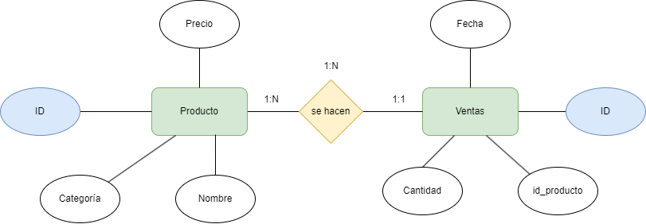
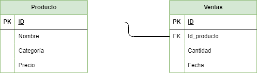
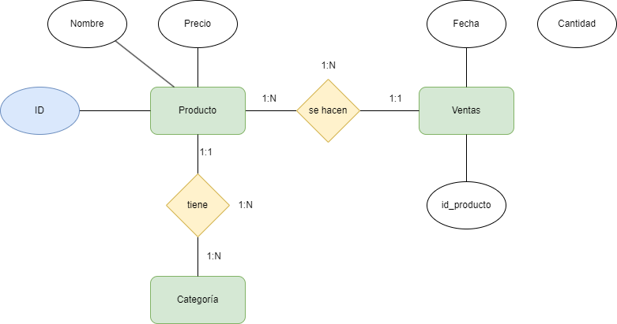
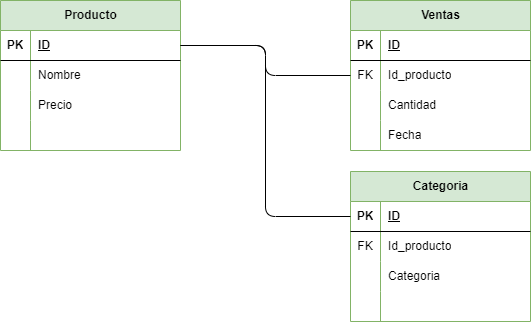

# Tarea 4

## Paso 1: Creación de la BBDD

Crea con el siguente contenido el fichero __supermercado-dump.sql__.

```sql
CREATE TABLE productos (
    id INTEGER PRIMARY KEY,
    nombre TEXT,
    categoria TEXT,
    precio REAL
);

CREATE TABLE ventas (
    id INTEGER PRIMARY KEY,
    id_producto INTEGER,
    cantidad INTEGER,
    fecha DATE,
    FOREIGN KEY (id_producto) REFERENCES productos(id)
);

INSERT INTO productos (id, nombre, categoria, precio) VALUES 
    (1, 'Arroz', 'Alimentos', 2.5),
    (2, 'Leche', 'Lácteos', 1.8),
    (3, 'Pan', 'Panadería', 1.2),
    (4, 'Manzanas', 'Frutas', 3.0),
    (5, 'Pollo', 'Carnes', 5.5),
    (6, 'Huevos', 'Lácteos', 1.0),
    (7, 'Yogurt', 'Lácteos', 2.0),
    (8, 'Tomates', 'Verduras', 2.2),
    (9, 'Queso', 'Lácteos', 4.0),
    (10, 'Cereal', 'Desayuno', 3.5),
    (11, 'Papel Higiénico', 'Hogar', 1.5),
    (12, 'Cepillo de Dientes', 'Higiene', 2.0),
    (13, 'Detergente', 'Limpieza', 2.8),
    (14, 'Galletas', 'Snacks', 1.7),
    (15, 'Aceite de Oliva', 'Cocina', 4.5),
    (16, 'Café', 'Bebidas', 5.0),
    (17, 'Sopa enlatada', 'Conservas', 2.3),
    (18, 'Jabón de Baño', 'Higiene', 1.2),
    (19, 'Botellas de Agua', 'Bebidas', 1.0),
    (20, 'Cerveza', 'Bebidas', 3.8);

INSERT INTO ventas (id_producto, cantidad, fecha) VALUES 
    (1, 5, '2024-01-17'),
    (2, 3, '2024-01-17'),
    (4, 2, '2024-01-17'),
    (5, 1, '2024-01-17'),
    (6, 10, '2024-01-18'),
    (8, 4, '2024-01-18'),
    (10, 2, '2024-01-18'),
    (14, 7, '2024-01-19'),
    (16, 3, '2024-01-19'),
    (18, 6, '2024-01-20');
```
  
## Paso 2 Lectura del fichero sql.

Entra en sqlite a través del siguiente comando:

```sql
sqlite3 tarea4.db 
```
## Paso 3: Responde a las siguientes cuestiones
### Realiza el diagrama ER de la BBDD supermercado.
## Modelo Entidad/Relación Empresa



### Realiza el diagrama MR de la BBDD supermercado.



### Indica si la BBDD esta normalizada hasta la 3ª forma normal, justificando la respuesta.
Para mi no cumplen las 3 primeras fornas nmormales debido a que :
Primera forna normal:
 Cada tabla tiene valores atómicos y únicos sin conjuntos repetitivos nmi atributos multievaluados.
 Segunda forma normal:
 Aquí es donde incumple las tablas debido a que a mi tras normalizar me saldrían los siguientes resultados debido a que yo crearía una tabla más resultande de hacer esta normalización en al cual pondriamos el las categorías por otro lado y quedarían así los dos modelos:

Modelo Entidad Relación después de normalizar:



Modelo Relacional después de normalizar:



Después de esta tranformación ya estaría bien normalizado.
## Paso 4: Responde a las siguientes cuestiones
### Realiza las siguientes consultas, y muestra el resultado obtenido:
#### Mostrar todos los productos de la categoría "Bebidas".
```sql
sqlite> SELECT * FROM productos WHERE categoria = 'Bebidas';
+----+------------------+-----------+--------+
| id |      nombre      | categoria | precio |
+----+------------------+-----------+--------+
| 16 | Café             | Bebidas   | 5.0    |
| 19 | Botellas de Agua | Bebidas   | 1.0    |
| 20 | Cerveza          | Bebidas   | 3.8    |
+----+------------------+-----------+--------+ +
```
#### Listar los productos ordenados por precio de forma descendente.
```sql
sqlite> SELECT * FROM productos ORDER BY precio DESC;
+----+--------------------+-----------+--------+
| id |       nombre       | categoria | precio |
+----+--------------------+-----------+--------+
| 5  | Pollo              | Carnes    | 5.5    |
| 16 | Café               | Bebidas   | 5.0    |
| 15 | Aceite de Oliva    | Cocina    | 4.5    |
| 9  | Queso              | Lácteos   | 4.0    |
| 20 | Cerveza            | Bebidas   | 3.8    |
| 10 | Cereal             | Desayuno  | 3.5    |
| 4  | Manzanas           | Frutas    | 3.0    |
| 13 | Detergente         | Limpieza  | 2.8    |
| 1  | Arroz              | Alimentos | 2.5    |
| 17 | Sopa enlatada      | Conservas | 2.3    |
| 8  | Tomates            | Verduras  | 2.2    |
| 7  | Yogurt             | Lácteos   | 2.0    |
| 12 | Cepillo de Dientes | Higiene   | 2.0    |
| 2  | Leche              | Lácteos   | 1.8    |
| 14 | Galletas           | Snacks    | 1.7    |
| 11 | Papel Higiénico    | Hogar     | 1.5    |
| 3  | Pan                | Panadería | 1.2    |
| 18 | Jabón de Baño      | Higiene   | 1.2    |
| 6  | Huevos             | Lácteos   | 1.0    |
| 19 | Botellas de Agua   | Bebidas   | 1.0    |
+----+--------------------+-----------+--------+
```

#### Calcular el precio total de todos los productos en la tabla "productos".
```sql
sqlite> SELECT SUM(precio) FROM productos;
+-------------+
| SUM(precio) |
+-------------+
| 52.5        |
+-------------+
```

#### Encontrar los productos con un nombre que contenga la letra 'a'.
```sql
sqlite> SELECT * FROM productos WHERE nombre LIKE '%a%';
+----+------------------+-----------+--------+
| id |      nombre      | categoria | precio |
+----+------------------+-----------+--------+
| 1  | Arroz            | Alimentos | 2.5    |
| 3  | Pan              | Panadería | 1.2    |
| 4  | Manzanas         | Frutas    | 3.0    |
| 8  | Tomates          | Verduras  | 2.2    |
| 10 | Cereal           | Desayuno  | 3.5    |
| 11 | Papel Higiénico  | Hogar     | 1.5    |
| 14 | Galletas         | Snacks    | 1.7    |
| 15 | Aceite de Oliva  | Cocina    | 4.5    |
| 16 | Café             | Bebidas   | 5.0    |
| 17 | Sopa enlatada    | Conservas | 2.3    |
| 18 | Jabón de Baño    | Higiene   | 1.2    |
| 19 | Botellas de Agua | Bebidas   | 1.0    |
| 20 | Cerveza          | Bebidas   | 3.8    |
+----+------------------+-----------+--------+
```

#### Obtener la cantidad total de productos vendidos en todas las fechas.
```sql
sqlite> SELECT SUM(cantidad) AS total_vendidos
   ...> FROM ventas;
+----------------+
| total_vendidos |
+----------------+
| 43             |
+----------------+
```

#### Encontrar el producto más caro en cada categoría.
```sql
sqlite> SELECT categoria, nombre, MAX(precio) AS precio_maximo
   ...> FROM productos
   ...> GROUP BY categoria;
+-----------+--------------------+---------------+
| categoria |       nombre       | precio_maximo |
+-----------+--------------------+---------------+
| Alimentos | Arroz              | 2.5           |
| Bebidas   | Café               | 5.0           |
| Carnes    | Pollo              | 5.5           |
| Cocina    | Aceite de Oliva    | 4.5           |
| Conservas | Sopa enlatada      | 2.3           |
| Desayuno  | Cereal             | 3.5           |
| Frutas    | Manzanas           | 3.0           |
| Higiene   | Cepillo de Dientes | 2.0           |
| Hogar     | Papel Higiénico    | 1.5           |
| Limpieza  | Detergente         | 2.8           |
| Lácteos   | Queso              | 4.0           |
| Panadería | Pan                | 1.2           |
| Snacks    | Galletas           | 1.7           |
| Verduras  | Tomates            | 2.2           |
+-----------+--------------------+---------------+
```
#### Listar los productos que no han sido vendidos.
```sql
sqlite> SELECT p.id, p.nombre, p.categoria, p.precio
   ...> FROM productos p
   ...> LEFT JOIN ventas v ON p.id = v.id_producto
   ...> WHERE v.id_producto IS NULL;
+----+--------------------+-----------+--------+
| id |       nombre       | categoria | precio |
+----+--------------------+-----------+--------+
| 3  | Pan                | Panadería | 1.2    |
| 7  | Yogurt             | Lácteos   | 2.0    |
| 9  | Queso              | Lácteos   | 4.0    |
| 11 | Papel Higiénico    | Hogar     | 1.5    |
| 12 | Cepillo de Dientes | Higiene   | 2.0    |
| 13 | Detergente         | Limpieza  | 2.8    |
| 15 | Aceite de Oliva    | Cocina    | 4.5    |
| 17 | Sopa enlatada      | Conservas | 2.3    |
| 19 | Botellas de Agua   | Bebidas   | 1.0    |
| 20 | Cerveza            | Bebidas   | 3.8    |
+----+--------------------+-----------+--------+
```
#### Calcular el precio promedio de los productos en la categoría "Snacks".
```sql
sqlite> SELECT AVG(precio) AS precio_promedio
   ...> FROM productos
   ...> WHERE categoria = 'Snacks';
+-----------------+
| precio_promedio |
+-----------------+
| 1.7             |
+-----------------+
```

#### Encontrar los productos que han sido vendidos más de 5 veces.
```sql
sqlite> SELECT p.id, p.nombre, p.categoria, SUM(v.cantidad) AS total_vendido
   ...> FROM productos p
   ...> JOIN ventas v ON p.id = v.id_producto
   ...> GROUP BY p.id
   ...> HAVING total_vendido > 5;
+----+---------------+-----------+---------------+
| id |    nombre     | categoria | total_vendido |
+----+---------------+-----------+---------------+
| 6  | Huevos        | Lácteos   | 10            |
| 14 | Galletas      | Snacks    | 7             |
| 18 | Jabón de Baño | Higiene   | 6             |
+----+---------------+-----------+---------------+
```

#### Mostrar la fecha y la cantidad de ventas para cada producto.
```sql
sqlite> SELECT v.fecha, p.nombre, SUM(v.cantidad) AS cantidad_vendida
   ...> FROM ventas v
   ...> JOIN productos p ON v.id_producto = p.id
   ...> GROUP BY v.fecha, p.id
   ...> ORDER BY v.fecha, p.nombre;
+------------+---------------+------------------+
|   fecha    |    nombre     | cantidad_vendida |
+------------+---------------+------------------+
| 2024-01-17 | Arroz         | 5                |
| 2024-01-17 | Leche         | 3                |
| 2024-01-17 | Manzanas      | 2                |
| 2024-01-17 | Pollo         | 1                |
| 2024-01-18 | Cereal        | 2                |
| 2024-01-18 | Huevos        | 10               |
| 2024-01-18 | Tomates       | 4                |
| 2024-01-19 | Café          | 3                |
| 2024-01-19 | Galletas      | 7                |
| 2024-01-20 | Jabón de Baño | 6                |
+------------+---------------+------------------+
```

#### Encontrar los productos que tienen un precio menor o igual a 2.
```sql
sqlite> SELECT id, nombre, categoria, precio
   ...> FROM productos
   ...> WHERE precio <= 2;
+----+--------------------+-----------+--------+
| id |       nombre       | categoria | precio |
+----+--------------------+-----------+--------+
| 2  | Leche              | Lácteos   | 1.8    |
| 3  | Pan                | Panadería | 1.2    |
| 6  | Huevos             | Lácteos   | 1.0    |
| 7  | Yogurt             | Lácteos   | 2.0    |
| 11 | Papel Higiénico    | Hogar     | 1.5    |
| 12 | Cepillo de Dientes | Higiene   | 2.0    |
| 14 | Galletas           | Snacks    | 1.7    |
| 18 | Jabón de Baño      | Higiene   | 1.2    |
| 19 | Botellas de Agua   | Bebidas   | 1.0    |
+----+--------------------+-----------+--------+
```

#### Calcular la cantidad total de ventas para cada fecha.
```sql
sqlite> SELECT fecha, SUM(cantidad) AS total_ventas
   ...> FROM ventas
   ...> GROUP BY fecha
   ...> ORDER BY fecha;
+------------+--------------+
|   fecha    | total_ventas |
+------------+--------------+
| 2024-01-17 | 11           |
| 2024-01-18 | 16           |
| 2024-01-19 | 10           |
| 2024-01-20 | 6            |
+------------+--------------+
```

#### Listar los productos cuyo nombre comienza con la letra 'P'.
```sql
sqlite> SELECT id, nombre, categoria, precio
   ...> FROM productos
   ...> WHERE nombre LIKE 'P%';
+----+-----------------+-----------+--------+
| id |     nombre      | categoria | precio |
+----+-----------------+-----------+--------+
| 3  | Pan             | Panadería | 1.2    |
| 5  | Pollo           | Carnes    | 5.5    |
| 11 | Papel Higiénico | Hogar     | 1.5    |
+----+-----------------+-----------+--------+
```
#### Obtener el producto más vendido en términos de cantidad.
```sql
sqlite> SELECT p.id, p.nombre, p.categoria, SUM(v.cantidad) AS total_vendido
   ...> FROM productos p
   ...> JOIN ventas v ON p.id = v.id_producto
   ...> GROUP BY p.id
   ...> ORDER BY total_vendido DESC
   ...> LIMIT 1;
+----+--------+-----------+---------------+
| id | nombre | categoria | total_vendido |
+----+--------+-----------+---------------+
| 6  | Huevos | Lácteos   | 10            |
+----+--------+-----------+---------------+
```

#### Mostrar los productos que fueron vendidos en la fecha '2024-01-18'.
```sql
sqlite> SELECT p.id, p.nombre, p.categoria, p.precio, v.cantidad, v.fecha
   ...> FROM productos p
   ...> JOIN ventas v ON p.id = v.id_producto
   ...> WHERE v.fecha = '2024-01-18';
+----+---------+-----------+--------+----------+------------+
| id | nombre  | categoria | precio | cantidad |   fecha    |
+----+---------+-----------+--------+----------+------------+
| 6  | Huevos  | Lácteos   | 1.0    | 10       | 2024-01-18 |
| 8  | Tomates | Verduras  | 2.2    | 4        | 2024-01-18 |
| 10 | Cereal  | Desayuno  | 3.5    | 2        | 2024-01-18 |
+----+---------+-----------+--------+----------+------------+
```

#### Calcular el total de ventas para cada producto.
```sql
sqlite> SELECT p.id, p.nombre, p.categoria, p.precio, SUM(v.cantidad) AS total_vendido,
   ...>        SUM(v.cantidad * p.precio) AS total_ventas
   ...> FROM productos p
   ...> JOIN ventas v ON p.id = v.id_producto
   ...> GROUP BY p.id
   ...> ORDER BY total_ventas DESC;
+----+---------------+-----------+--------+---------------+--------------+
| id |    nombre     | categoria | precio | total_vendido | total_ventas |
+----+---------------+-----------+--------+---------------+--------------+
| 16 | Café          | Bebidas   | 5.0    | 3             | 15.0         |
| 1  | Arroz         | Alimentos | 2.5    | 5             | 12.5         |
| 14 | Galletas      | Snacks    | 1.7    | 7             | 11.9         |
| 6  | Huevos        | Lácteos   | 1.0    | 10            | 10.0         |
| 8  | Tomates       | Verduras  | 2.2    | 4             | 8.8          |
| 18 | Jabón de Baño | Higiene   | 1.2    | 6             | 7.2          |
| 10 | Cereal        | Desayuno  | 3.5    | 2             | 7.0          |
| 4  | Manzanas      | Frutas    | 3.0    | 2             | 6.0          |
| 5  | Pollo         | Carnes    | 5.5    | 1             | 5.5          |
| 2  | Leche         | Lácteos   | 1.8    | 3             | 5.4          |
+----+---------------+-----------+--------+---------------+--------------+
```

#### Encontrar los productos con un precio entre 3 y 4.
```sql
sqlite> SELECT id, nombre, categoria, precio
   ...> FROM productos
   ...> WHERE precio BETWEEN 3 AND 4;
+----+----------+-----------+--------+
| id |  nombre  | categoria | precio |
+----+----------+-----------+--------+
| 4  | Manzanas | Frutas    | 3.0    |
| 9  | Queso    | Lácteos   | 4.0    |
| 10 | Cereal   | Desayuno  | 3.5    |
| 20 | Cerveza  | Bebidas   | 3.8    |
+----+----------+-----------+--------+
```
#### Listar los productos y sus categorías ordenados alfabéticamente por categoría.
```sql
sqlite> SELECT id, nombre, categoria
   ...> FROM productos
   ...> ORDER BY categoria ASC;
+----+--------------------+-----------+
| id |       nombre       | categoria |
+----+--------------------+-----------+
| 1  | Arroz              | Alimentos |
| 16 | Café               | Bebidas   |
| 19 | Botellas de Agua   | Bebidas   |
| 20 | Cerveza            | Bebidas   |
| 5  | Pollo              | Carnes    |
| 15 | Aceite de Oliva    | Cocina    |
| 17 | Sopa enlatada      | Conservas |
| 10 | Cereal             | Desayuno  |
| 4  | Manzanas           | Frutas    |
| 12 | Cepillo de Dientes | Higiene   |
| 18 | Jabón de Baño      | Higiene   |
| 11 | Papel Higiénico    | Hogar     |
| 13 | Detergente         | Limpieza  |
| 2  | Leche              | Lácteos   |
| 6  | Huevos             | Lácteos   |
| 7  | Yogurt             | Lácteos   |
| 9  | Queso              | Lácteos   |
| 3  | Pan                | Panadería |
| 14 | Galletas           | Snacks    |
| 8  | Tomates            | Verduras  |
+----+--------------------+-----------+
```

#### Calcular el precio total de los productos vendidos en la fecha '2024-01-19'.
```sql
sqlite> SELECT SUM(v.cantidad * p.precio) AS total_ventas
   ...> FROM ventas v
   ...> JOIN productos p ON v.id_producto = p.id
   ...> WHERE v.fecha = '2024-01-19';
+--------------+
| total_ventas |
+--------------+
| 26.9         |
+--------------+
```

#### Mostrar los productos que no pertenecen a la categoría "Higiene".
```sql
sqlite> SELECT id, nombre, categoria, precio
   ...> FROM productos
   ...> WHERE categoria != 'Higiene';
+----+------------------+-----------+--------+
| id |      nombre      | categoria | precio |
+----+------------------+-----------+--------+
| 1  | Arroz            | Alimentos | 2.5    |
| 2  | Leche            | Lácteos   | 1.8    |
| 3  | Pan              | Panadería | 1.2    |
| 4  | Manzanas         | Frutas    | 3.0    |
| 5  | Pollo            | Carnes    | 5.5    |
| 6  | Huevos           | Lácteos   | 1.0    |
| 7  | Yogurt           | Lácteos   | 2.0    |
| 8  | Tomates          | Verduras  | 2.2    |
| 9  | Queso            | Lácteos   | 4.0    |
| 10 | Cereal           | Desayuno  | 3.5    |
| 11 | Papel Higiénico  | Hogar     | 1.5    |
| 13 | Detergente       | Limpieza  | 2.8    |
| 14 | Galletas         | Snacks    | 1.7    |
| 15 | Aceite de Oliva  | Cocina    | 4.5    |
| 16 | Café             | Bebidas   | 5.0    |
| 17 | Sopa enlatada    | Conservas | 2.3    |
| 19 | Botellas de Agua | Bebidas   | 1.0    |
| 20 | Cerveza          | Bebidas   | 3.8    |
+----+------------------+-----------+--------+
```

#### Encontrar la cantidad total de productos en cada categoría.
```sql
sqlite> SELECT categoria, COUNT(*) AS cantidad_productos
   ...> FROM productos
   ...> GROUP BY categoria;
+-----------+--------------------+
| categoria | cantidad_productos |
+-----------+--------------------+
| Alimentos | 1                  |
| Bebidas   | 3                  |
| Carnes    | 1                  |
| Cocina    | 1                  |
| Conservas | 1                  |
| Desayuno  | 1                  |
| Frutas    | 1                  |
| Higiene   | 2                  |
| Hogar     | 1                  |
| Limpieza  | 1                  |
| Lácteos   | 4                  |
| Panadería | 1                  |
| Snacks    | 1                  |
| Verduras  | 1                  |
+-----------+--------------------+
```

#### Listar los productos que tienen un precio igual a la media de precios.
```sql
    sqlite> SELECT * FROM productos WHERE precio = (SELECT AVG(precio) FROM productos);
    sqlite> 
```

#### Calcular el precio total de los productos vendidos en cada fecha.
```sql
sqlite> SELECT v.fecha, SUM(v.cantidad * p.precio) AS total_ventas
   ...> FROM ventas v
   ...> JOIN productos p ON v.id_producto = p.id
   ...> GROUP BY v.fecha;
+------------+--------------+
|   fecha    | total_ventas |
+------------+--------------+
| 2024-01-17 | 29.4         |
| 2024-01-18 | 25.8         |
| 2024-01-19 | 26.9         |
| 2024-01-20 | 7.2          |
+------------+--------------+
```

#### Mostrar los productos con un nombre que termina con la letra 'o'.
```sql
sqlite> SELECT id, nombre, categoria, precio
   ...> FROM productos
   ...> WHERE nombre LIKE '%o';
+----+-----------------+-----------+--------+
| id |     nombre      | categoria | precio |
+----+-----------------+-----------+--------+
| 5  | Pollo           | Carnes    | 5.5    |
| 9  | Queso           | Lácteos   | 4.0    |
| 11 | Papel Higiénico | Hogar     | 1.5    |
| 18 | Jabón de Baño   | Higiene   | 1.2    |
+----+-----------------+-----------+--------+
```

#### Encontrar los productos que han sido vendidos en más de una fecha.
```sql
sqlite> SELECT p.nombre, COUNT(DISTINCT v.fecha) AS total_fechas FROM ventas v JOIN productos p ON v.id_producto = p.id GROUP BY v.id_producto HAVING COUNT(DISTINCT v.fecha) > 1;                                       
sqlite> 
```

#### Listar los productos cuya categoría comienza con la letra 'L'.
```sql
sqlite> SELECT id, nombre, categoria, precio
   ...> FROM productos
   ...> WHERE categoria LIKE 'L%';
+----+------------+-----------+--------+
| id |   nombre   | categoria | precio |
+----+------------+-----------+--------+
| 2  | Leche      | Lácteos   | 1.8    |
| 6  | Huevos     | Lácteos   | 1.0    |
| 7  | Yogurt     | Lácteos   | 2.0    |
| 9  | Queso      | Lácteos   | 4.0    |
| 13 | Detergente | Limpieza  | 2.8    |
+----+------------+-----------+--------+
```

#### Calcular el total de ventas para cada producto en la fecha '2024-01-17'.
```sql
sqlite> SELECT p.id, p.nombre, p.categoria, SUM(v.cantidad) AS total_vendido, p.precio, SUM(v.cantidad) * p.precio AS total_ventas
   ...> FROM ventas v
   ...> JOIN productos p ON v.id_producto = p.id
   ...> WHERE v.fecha = '2024-01-17'
   ...> GROUP BY p.id;
+----+----------+-----------+---------------+--------+--------------+
| id |  nombre  | categoria | total_vendido | precio | total_ventas |
+----+----------+-----------+---------------+--------+--------------+
| 1  | Arroz    | Alimentos | 5             | 2.5    | 12.5         |
| 2  | Leche    | Lácteos   | 3             | 1.8    | 5.4          |
| 4  | Manzanas | Frutas    | 2             | 3.0    | 6.0          |
| 5  | Pollo    | Carnes    | 1             | 5.5    | 5.5          |
+----+----------+-----------+---------------+--------+--------------+
```

#### Mostrar los productos cuyo nombre tiene al menos 5 caracteres.
```sql
sqlite> SELECT id, nombre, categoria, precio
   ...> FROM productos
   ...> WHERE LENGTH(nombre) >= 5;
+----+--------------------+-----------+--------+
| id |       nombre       | categoria | precio |
+----+--------------------+-----------+--------+
| 1  | Arroz              | Alimentos | 2.5    |
| 2  | Leche              | Lácteos   | 1.8    |
| 4  | Manzanas           | Frutas    | 3.0    |
| 5  | Pollo              | Carnes    | 5.5    |
| 6  | Huevos             | Lácteos   | 1.0    |
| 7  | Yogurt             | Lácteos   | 2.0    |
| 8  | Tomates            | Verduras  | 2.2    |
| 9  | Queso              | Lácteos   | 4.0    |
| 10 | Cereal             | Desayuno  | 3.5    |
| 11 | Papel Higiénico    | Hogar     | 1.5    |
| 12 | Cepillo de Dientes | Higiene   | 2.0    |
| 13 | Detergente         | Limpieza  | 2.8    |
| 14 | Galletas           | Snacks    | 1.7    |
| 15 | Aceite de Oliva    | Cocina    | 4.5    |
| 17 | Sopa enlatada      | Conservas | 2.3    |
| 18 | Jabón de Baño      | Higiene   | 1.2    |
| 19 | Botellas de Agua   | Bebidas   | 1.0    |
| 20 | Cerveza            | Bebidas   | 3.8    |
+----+--------------------+-----------+--------+
```

#### Encontrar los productos que tienen un precio superior al precio máximo en la tabla "productos".
```sql
sqlite> SELECT * FROM productos WHERE precio > (SELECT MAX(precio) FROM productos);
sqlite>
```
