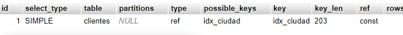
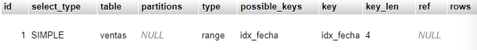
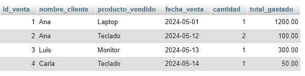
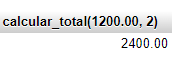
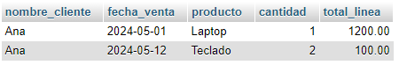
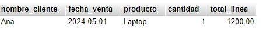
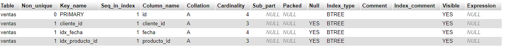
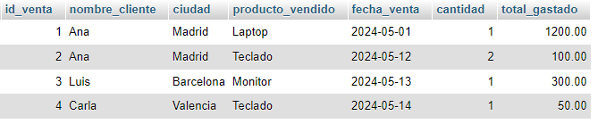
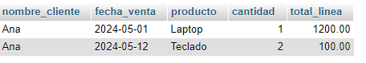

<div align="justify">


## Enunciado del ejercicio

La empresa "TecnoMarket" quiere analizar las ventas realizadas por sus clientes. Para ello, necesita organizar la información en su base de datos y optimizar el rendimiento de las consultas.

### Tu tarea consiste en

1. Crear las tablas necesarias.
2. Insertar índices que mejoren las búsquedas más frecuentes.
3. Crear una vista que resuma las ventas.
4. Definir una función para calcular totales.
5. Crear un procedimiento que devuelva el resumen de ventas de un cliente específico.
6. Ejecutar el procedimiento para validar el resultado.

---

## 📘 Parte 1: Creación de tablas

```sql
CREATE TABLE clientes (
    id INT AUTO_INCREMENT PRIMARY KEY,
    nombre VARCHAR(100),
    ciudad VARCHAR(50)
);

CREATE TABLE productos (
    id INT AUTO_INCREMENT PRIMARY KEY,
    nombre VARCHAR(100),
    precio DECIMAL(10, 2)
);

CREATE TABLE ventas (
    id INT AUTO_INCREMENT PRIMARY KEY,
    cliente_id INT,
    producto_id INT,
    fecha DATE,
    cantidad INT,
    FOREIGN KEY (cliente_id) REFERENCES clientes(id),
    FOREIGN KEY (producto_id) REFERENCES productos(id)
);
INSERT INTO productos (id, nombre, precio) VALUES
(1, 'Laptop', 1200.00),
(2, 'Teclado', 50.00),
(3, 'Monitor', 300.00);

INSERT INTO ventas (id, cliente_id, producto_id, fecha, cantidad) VALUES
(1, 1, 1, '2024-05-01', 1),
(2, 1, 2, '2024-05-12', 2),
(3, 2, 3, '2024-05-13', 1),
(4, 3, 2, '2024-05-14', 1);
```

---

## 🔍 Parte 2: Creación de índices

Crea los siguientes clientes:

- **idx_ciudad** sobre la tabla clientes y el campo ciudad.
- **idx_fecha** sobre la tabla ventas, y el campo fecha.
```sql
CREATE INDEX idx_ciudad ON clientes(ciudad);
CREATE INDEX idx_fecha ON ventas(fecha);
```
### ¿Preguntas?

- Crea los indices, muestra su rendimiento, y explica si son óptimos y por qué?.
```sql
EXPLAIN SELECT * FROM clientes WHERE ciudad = 'Madrid';
```


```sql
EXPLAIN SELECT * FROM ventas WHERE fecha BETWEEN '2024-05-01' AND '2024-05-10';
```

---
¿Son óptimos?
Sí, son óptimos si haces muchas búsquedas o filtros por esas columnas.

idx_ciudad es útil si se consulta frecuentemente por ciudad.

idx_fecha acelera filtros por rango de fechas.
Ambos mejoran el rendimiento de consultas, pero si las columnas tienen poca variedad de valores (baja cardinalidad), el beneficio será limitado.

## 👁️ Parte 3: Crear una vista

- **Obtén, a través de una vista**, la siguiente información detallada de cada venta:

- ID de la venta
- Nombre del cliente
- Producto vendido
- Fecha de la venta
- Cantidad comprada
- Total gastado (precio × cantidad)

La vista **vista** que consolida los datos de las tablas `ventas`, `clientes` y `productos`, permitiendo consultar fácilmente el historial de ventas detallado.

> **RECUERDA**: Una vista es una **consulta sql** encapsulada en una tabla ficticia.

### 📊 Resultado esperado

| venta_id | cliente     | producto | fecha       | cantidad | total   |
|----------|-------------|----------|-------------|----------|---------|
| 1        | Ana Pérez   | Laptop   | 2024-05-01  | 1        | 1200.00 |
| 2        | Ana Pérez   | Teclado  | 2024-05-12  | 2        | 100.00  |
| 3        | Luis Gómez  | Monitor  | 2024-05-13  | 1        | 300.00  |
| 4        | Carla Ruiz  | Teclado  | 2024-05-14  | 1        | 50.00   |

---
```sql
CREATE VIEW vista_ventas_detalladas AS
SELECT 
    v.id AS id_venta,
    c.nombre AS nombre_cliente,
    p.nombre AS producto_vendido,
    v.fecha AS fecha_venta,
    v.cantidad,
    (p.precio * v.cantidad) AS total_gastado
FROM ventas v
JOIN clientes c ON v.cliente_id = c.id
JOIN productos p ON v.producto_id = p.id;

```
Ahora hacemos esto
```sql
SELECT * FROM vista_ventas_detalladas;
```
este es el resultado de la consulta


## 🧮 Parte 4: Crear una función

Crea una **función almacenada** en MySQL llamada `calcular_total` que reciba los siguientes parámetros:

- `precio`: un valor decimal con dos decimales (precio del producto)
- `cantidad`: un número entero que representa las unidades compradas

La función debe devolver el resultado de multiplicar ambos valores, es decir, el **total a pagar** por esa línea de venta.

```sql
DELIMITER //

CREATE FUNCTION calcular_total(
    precio DECIMAL(10,2),
    cantidad INT
)
RETURNS DECIMAL(10,2)
DETERMINISTIC
BEGIN
    RETURN precio * cantidad;
END //

DELIMITER ;

```

```sql
SELECT calcular_total(1200.00, 2);
```

| calcular_total(1200.00, 2) |
|----------------------------|
| 2400.00                    |


---



## ⚙️ Parte 5: Crear un procedimiento

Crea un procedimiento llamado `resumen_cliente` que reciba como parámetro el **ID de un cliente** (`cliente_id`), y que devuelva el **historial de ventas** de dicho cliente.  
El procedimiento debe mostrar los siguientes datos por cada venta realizada por ese cliente:

- El **nombre del cliente**
- La **fecha de la venta**
- El **nombre del producto**
- La **cantidad comprada**
- El **total de la línea de venta**, calculado como `precio * cantidad`

💡 **Sugerencia:** Puedes reutilizar una función existente (como `calcular_total`) o calcular el total directamente en la consulta.

```sql
DELIMITER $$

CREATE PROCEDURE resumen_cliente(IN cliente_id INT)
BEGIN
    SELECT 
        c.nombre AS nombre_cliente,
        v.fecha AS fecha_venta,
        p.nombre AS producto,
        v.cantidad,
        (p.precio * v.cantidad) AS total_linea
    FROM ventas v
    JOIN clientes c ON v.cliente_id = c.id
    JOIN productos p ON v.producto_id = p.id
    WHERE c.id = cliente_id;
END $$

DELIMITER ;

```

```sql
CALL resumen_cliente(1);
```

Con el siguiente resultado: 

| nombre     | fecha       | producto   | cantidad | total   |
|------------|-------------|------------|----------|---------|
| Ana Pérez | 2024-05-01  | Laptop     | 1        | 1200.00 |
| Ana Pérez | 2024-05-12  | Teclado    | 2        | 100.00  |

> *Este resultado depende de los datos que se hayan insertado en la base de datos.*

---



## ❓ Preguntas teóricas

1. ¿Qué ventajas ofrece el uso de una vista en lugar de una consulta con múltiples `JOIN`?

   Facilita la reutilización, simplifica consultas complejas y mejora la legibilidad sin repetir JOIN cada vez. 
    
2. ¿Por qué es importante declarar una función como `DETERMINISTIC`?

    Indica que siempre devuelve el mismo resultado para los mismos parámetros, permitiendo optimizaciones del motor de MySQL.

3. ¿Cuál es la diferencia entre una función y un procedimiento?

    La función devuelve un valor y se usa en consultas; el procedimiento ejecuta acciones y no necesariamente devuelve un valor.

4. ¿Qué impacto tienen los índices sobre el rendimiento de una base de datos?

    Aceleran búsquedas y filtros, pero pueden ralentizar inserciones y actualizaciones por el mantenimiento del índice.

5. ¿Cuándo se recomienda usar un trigger en lugar de un procedimiento?

    Cuando necesitas ejecutar acciones automáticas en respuesta a eventos (como INSERT, UPDATE o DELETE) sin intervención directa.
---

## 📝 Preguntas prácticas

1. Modifica el procedimiento para filtrar también por un rango de fechas.
```sql
DELIMITER $$

CREATE PROCEDURE resumen_cliente(
    IN cliente_id INT,
    IN fecha_inicio DATE,
    IN fecha_fin DATE
)
BEGIN
    SELECT 
        c.nombre AS nombre_cliente,
        v.fecha AS fecha_venta,
        p.nombre AS producto,
        v.cantidad,
        (p.precio * v.cantidad) AS total_linea
    FROM ventas v
    JOIN clientes c ON v.cliente_id = c.id
    JOIN productos p ON v.producto_id = p.id
    WHERE c.id = cliente_id AND v.fecha BETWEEN fecha_inicio AND fecha_fin;
END $$

DELIMITER ;

```
se prueba usando la sigueinte consulta sql

```sql
CALL resumen_cliente(1, '2024-05-01', '2024-05-11');
```
da el siguiente resultado



2. Crea un índice sobre la columna `producto_id` en la tabla `ventas`.

```sql
    CREATE INDEX idx_producto_id ON ventas(producto_id);
```
Verificamos que lo hemos creado con la sigueinte consulta de sql

```sql    
    SHOW INDEX FROM ventas;
```
y verificamos los indices de la tabal ventas 



3. ¿Qué ocurre si insertas una venta con un `cliente_id` inexistente?

MySQL lanza un error de restricción de clave foránea (foreign key) y no permite la inserción, porque el cliente_id debe existir en la tabla clientes.
  intentamos hacer un ejemplo apra que nsod e ese error con este código SQL

  ```sql
    INSERT INTO ventas (cliente_id, producto_id, fecha, cantidad)
    VALUES (999, 1, '2024-05-20', 1);
  ```
  y este es el emnsaje de error que nos da
  -- Este cliente_id = 999 no existe, así que dará errorINSERT INTO ventas (cliente_id, producto_id, fecha, cantidad)VALUES (999, 1, '2024-05-20', 1);

4. Modifica la vista para incluir también el nombre de la ciudad del cliente.
```sql
CREATE OR REPLACE VIEW vista_ventas_detalladas AS
SELECT 
    v.id AS id_venta,
    c.nombre AS nombre_cliente,
    c.ciudad,
    p.nombre AS producto_vendido,
    v.fecha AS fecha_venta,
    v.cantidad,
    (p.precio * v.cantidad) AS total_gastado
FROM ventas v
JOIN clientes c ON v.cliente_id = c.id
JOIN productos p ON v.producto_id = p.id;

```
Lo verificamos con esta consulta de sql
```sql
SELECT * FROM vista_ventas_detalladas;
``` 


5. Agrega una validación en el procedimiento para evitar resultados si el cliente no existe.

```sql
    DELIMITER $$

CREATE PROCEDURE resumen_cliente_seguro(
    IN cliente_id INT
)
BEGIN
    -- Validación: verificar si existe el cliente
    IF EXISTS (SELECT 1 FROM clientes WHERE id = cliente_id) THEN
        SELECT 
            c.nombre AS nombre_cliente,
            v.fecha AS fecha_venta,
            p.nombre AS producto,
            v.cantidad,
            (p.precio * v.cantidad) AS total_linea
        FROM ventas v
        JOIN clientes c ON v.cliente_id = c.id
        JOIN productos p ON v.producto_id = p.id
        WHERE c.id = cliente_id;
    ELSE
        SELECT 'Cliente no encontrado' AS mensaje;
    END IF;
END $$

DELIMITER ;

```
Cuando introducimos un id que esta dentro de la tabla clientes con esta consulta sql

```sql
CALL resumen_cliente_seguro(1);
```
nos muestra el sigueinte resultado



Sin embargo cuando introducimos un id que nmo esta en la tabla de id cliente nos sale este mensaje de error

```sql
CALL resumen_cliente_seguro(999);
```
nos muestra el sigueinte resultado


</div>