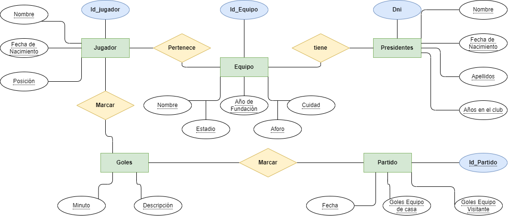
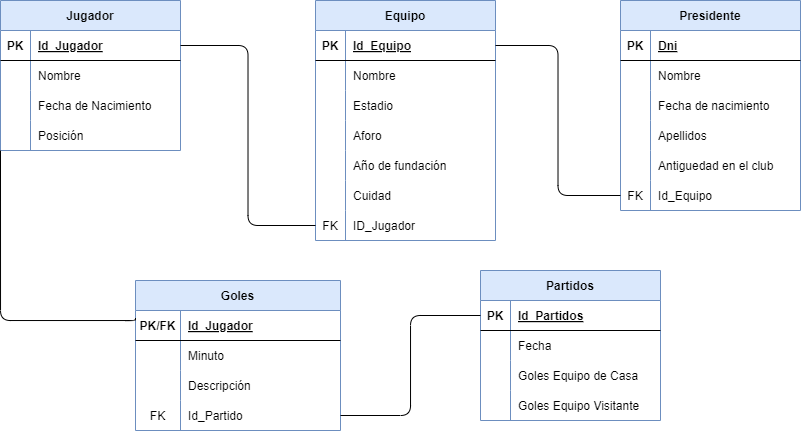
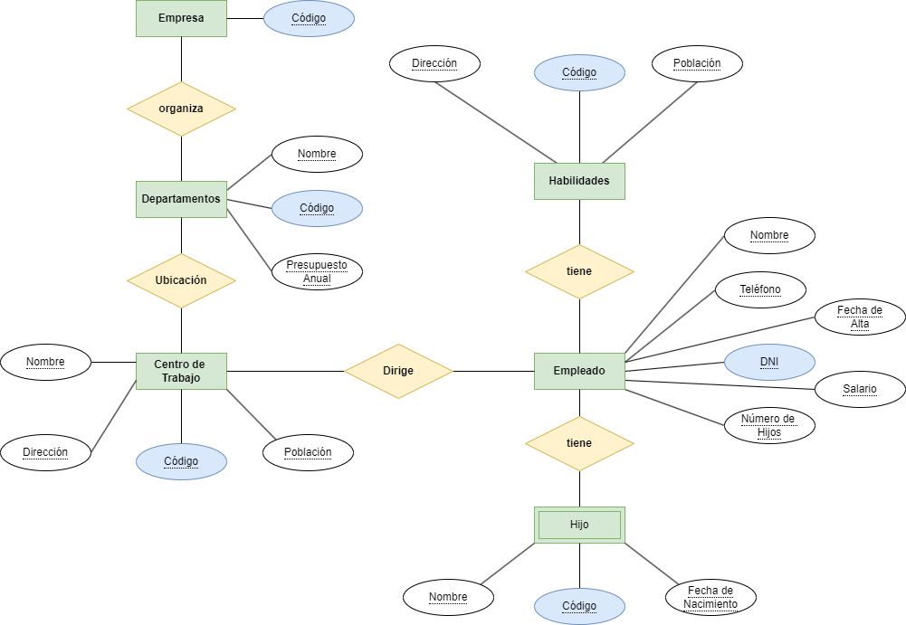

# Ejercicio 4

## Modelo Entidad/Relación LFP 

### Enunciado

La liga de fútbol profesional ha decidido informatizar sus instalaciones creando una base de datos para guardar la información de los partidos que se juegan en la liga.

Se desea guardar en primer lugar los datos de los jugadores. De cada jugador se quiere guardar el nombre, fecha de nacimiento y posición en la que juega (portero, defensa,centrocampista…).
Cada jugador tiene un código de jugador que lo identifica de manera única.

De cada uno de los equipos de la liga es necesario registrar el nombre del equipo, nombre del estadio en el que juega, el aforo que tiene, el año de fundación del equipo y la ciudad de la que es el equipo. Cada equipo también tiene un código que lo identifica de manera única. Un jugador solo puede pertenecer a un único equipo.
De cada partido que los equipos de la liga juegan hay que registrar la fecha en la que se juega el partido, los goles que ha metido el equipo de casa y los goles que ha metido el equipo de fuera. Cada partido tendrá un código numérico para identificar el partido.

También se quiere llevar un recuento de los goles que hay en cada partido. Se quiere almacenar el minuto en el que se realizar el gol y la descripción del gol. Un partido tiene varios goles y un jugador puede meter varios goles en un partido.

Por último se quiere almacenar, en la base de datos, los datos de los presidentes de los equipos de fútbol (dni, nombre, apellidos, fecha de nacimiento, equipo del que es presidente y año en el que fue elegido presidente). Un equipo de fútbol tan sólo puede tener un presidente, y una persona sólo puede ser presidente de un equipo de la liga.

## Modelo Relacional  LFP

### Enunciado

La liga de fútbol profesional ha decidido informatizar sus instalaciones creando una base de datos para guardar la información de los partidos que se juegan en la liga.

Se desea guardar en primer lugar los datos de los jugadores. De cada jugador se quiere guardar el nombre, fecha de nacimiento y posición en la que juega (portero, defensa,centrocampista…).
Cada jugador tiene un código de jugador que lo identifica de manera única.

De cada uno de los equipos de la liga es necesario registrar el nombre del equipo, nombre del estadio en el que juega, el aforo que tiene, el año de fundación del equipo y la ciudad de la que es el equipo. Cada equipo también tiene un código que lo identifica de manera única. Un jugador solo puede pertenecer a un único equipo.
De cada partido que los equipos de la liga juegan hay que registrar la fecha en la que se juega el partido, los goles que ha metido el equipo de casa y los goles que ha metido el equipo de fuera. Cada partido tendrá un código numérico para identificar el partido.

También se quiere llevar un recuento de los goles que hay en cada partido. Se quiere almacenar el minuto en el que se realizar el gol y la descripción del gol. Un partido tiene varios goles y un jugador puede meter varios goles en un partido.

Por último se quiere almacenar, en la base de datos, los datos de los presidentes de los equipos de fútbol (dni, nombre, apellidos, fecha de nacimiento, equipo del que es presidente y año en el que fue elegido presidente). Un equipo de fútbol tan sólo puede tener un presidente, y una persona sólo puede ser presidente de un equipo de la liga.

Diseña elmodelo entidad-relación resultante al modelo relacional a través de diagrams.io

# Ejercicio 5

### Enunciado

Una empresa necesita organizar la siguiente información referente a su organización interna.
La empresa está organizada en una serie de departamentos. Cada departamento tiene un
código, nombre y presupuesto anual. Cada departamento está ubicado en un centro de trabajo. La información que se desea guardar del centro de trabajo es el código de centro, nombre, población y dirección del centro.
La empresa tiene una serie de empleados. Cada empleado tiene un teléfono, fecha de
alta en la empresa, NIF y nombre. De cada empleado también interesa saber el número de hijos que tiene y el salario de cada empleado.
A esta empresa también le interesa tener guardada información sobre los hijos de los
empleados. Cada hijo de un empleado tendrá un código, nombre y fecha de nacimiento.
Se desea mantener también información sobre las habilidades de los empleados (por ejemplo, mercadotecnia, trato con el cliente, fresador, operador de telefonía, etc…). Cada
habilidad tendrá una descripción y un código”.
Se pretende diseñar el modelo E/R y el modelo relacional teniendo en cuenta los siguientes aspectos:

- Un empleado está asignado a un único departamento. Un departamento estará compuesto por uno o más empleados.
- Cada departamento se ubica en un único centro de trabajo. Estos se componen de
uno o más departamentos.
- Un empleado puede tener varios hijos.
- Un empleado puede tener varias habilidades, y una misma habilidad puede ser
poseída por empleados diferentes.
- Un centro de trabajo es dirigido por un empleado. Un mismo empleado puede

## Modelo Entidad/Relación Empresa

## Modelo Relacional Empresa

