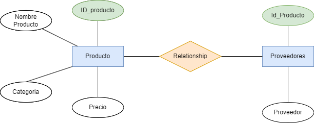

div align="justify">

# Ejercicio 6

## Ejercicio 1: Lista de productos

### **Tabla Inicial: Productos**

| ID_Producto | Nombre_Producto | Proveedores      | Categoría   | Precio |
|------------|----------------|-----------------|------------|--------|
| 1          | Laptop         | Dell, HP        | Tecnología | 1000   |
| 2          | Mouse          | Logitech        | Accesorios | 25     |

### **Tareas:**

1. Aplicar **1FN**, eliminando los valores multivaluados en "Proveedores".

Al aplicar la  **1FN**, procedemos a atomizar los valores de todas las columnas y que todas las filas son únicas, por esto dividimso en dos las tablas:

#### **Tabla de Productos**
| ID_Producto | Nombre_Producto | Categoría   | Precio |
|------------|----------------|------------|--------|
| 1          | Laptop         | Tecnología | 1000   |
| 2          | Mouse          | Accesorios | 25     |

#### **Tabla de Provedores**
| ID_Producto | Proveedor  |
|------------|-------------|
| 1          | Dell        | 
| 2          | HP          | 
| 3          | Logitech    | 

Ahora cada tabla tiene valores atómicos y filas únicas.

2. Aplicar **2FN**, asegurando que cada campo dependa completamente de la clave primaria.

Ene ste caso al realizar la **1FN**, nos damso cuenta que ya hemos divido en dos la tabla y por lo tanto estas dos tablas complen la **2FN**, porque esta norma nos dice que debemso asegurar que todas las tablas ya estén en **1FN** y que todos los atributos no primario dependan completamente de la clave primaria **PK**.

**Modelo E/R resultante**

