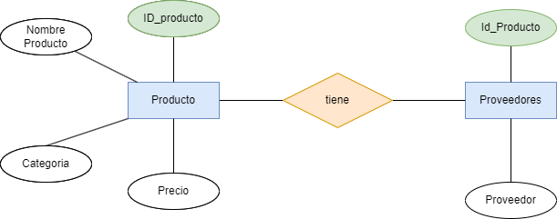
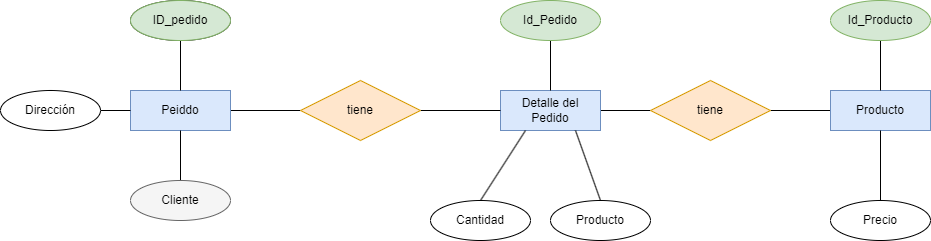
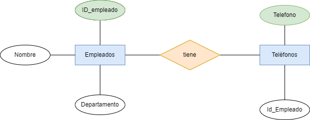
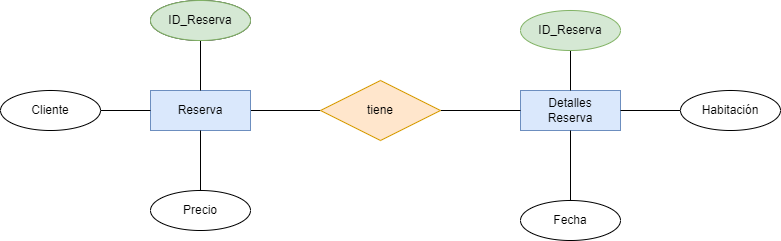
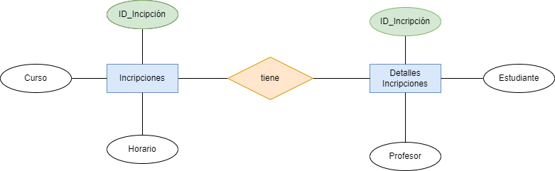
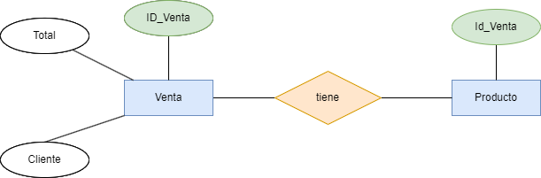
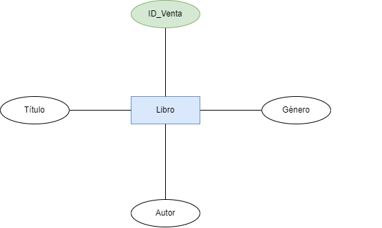

# Ejercicio 6

## Ejercicio 1: Lista de productos

### **Tabla Inicial: Productos**

| ID_Producto | Nombre_Producto | Proveedores      | Categoría   | Precio |
|------------|----------------|-----------------|------------|--------|
| 1          | Laptop         | Dell, HP        | Tecnología | 1000   |
| 2          | Mouse          | Logitech        | Accesorios | 25     |

### **Tareas:**

1. Aplicar **1FN**, eliminando los valores multivaluados en "Proveedores".

Al aplicar la  **1FN**, procedemos a atomizar los valores de todas las columnas y que todas las filas son únicas, por esto dividimos en dos las tablas:

#### **Tabla de Productos**
| ID_Producto | Nombre_Producto | Categoría   | Precio |
|------------|----------------|------------|--------|
| 1          | Laptop         | Tecnología | 1000   |
| 2          | Mouse          | Accesorios | 25     |

#### **Tabla de Provedores**
| ID_Producto | Proveedor  |
|------------|-------------|
| 1          | Dell        | 
| 2          | HP          | 
| 3          | Logitech    | 

Ahora cada tabla tiene valores atómicos y filas únicas.

2. Aplicar **2FN**, asegurando que cada campo dependa completamente de la clave primaria.

En este caso al realizar la **1FN**, nos damos cuenta que ya hemos divido en dos la tabla y por lo tanto estas dos tablas complen la **2FN**, porque esta norma nos dice que debemso asegurar que todas las tablas ya estén en **1FN** y que todos los atributos no primario dependan completamente de la clave primaria **PK**.

**Modelo E/R resultante**

## Ejercicio 2: Pedidos de clientes

### **Tabla Inicial: Clientes**

| ID_Pedido | Cliente   | Dirección       | Producto     | Cantidad | Precio |
|----------|----------|---------------|-------------|----------|--------|
| 101      | Juan Pérez | Calle 123     | Laptop      | 1        | 1000   |
| 102      | Ana López | Av. Central   | Teclado     | 2        | 50     |

### **Tareas:**

1. Aplicar **1FN**, eliminando los valores multivaluados en "Proveedores".

Al aplicar la  **1FN**, procedemos a atomizar los valores de todas las columnas y que todas las filas son únicas, por esto dividimos en dos las tablas:

#### **Tabla de Pedidos**
| ID_Pedido | Cliente    | Dirección       |
|-----------|------------|-----------------|
| 101       | Juan Pérez | Calle 123       |
| 102       | Ana López  | Av. Central     |

#### **Tabla de Detalles del Pedido**
| ID_Pedido | Producto | Cantidad | Precio |
|-----------|----------|----------|--------|
| 101       | Laptop   | 1        | 1000   |
| 102       | Teclado  | 2        | 50     |

Ahora cada tabla tiene valores atómicos y filas únicas. En este caso la tablá ya era atómica pero dividimos la tabla en dos para que cumpla con las normas del **1FN**.

2. Aplicar **2FN**, asegurando que cada campo dependa completamente de la clave primaria.
La tabla de Pedidos se queda de la misma forma, pero la tabla de Detalles del peiddo tenemos que volverla a dividir en dos para que así cumpla con la norma de que los atributos no primarios dependan de la clave primaria siendo estas la nuevas tablas:

#### **Tabla de Pedidos**
| ID_Pedido | Cliente    | Dirección       |
|-----------|------------|-----------------|
| 101       | Juan Pérez | Calle 123       |
| 102       | Ana López  | Av. Central     |

#### **Tabla de Productos**
| Producto | Precio |
|----------|--------|
| Laptop   | 1000   |
| Teclado  | 50     |

#### **Tabla de Detalles_Pedido**
| ID_Pedido | Producto | Cantidad |
|-----------|----------|----------|
| 101       | Laptop   | 1        |
| 102       | Teclado  | 2        |

**Modelo E/R resultante**

## Ejercicio 3: Registro de empleados

### **Tabla Inicial: Empleados**

| ID_Empleado | Nombre     | Teléfonos         | Departamento |
|------------|------------|------------------|--------------|
| 1          | Carlos R.  | 12345, 67890     | Ventas       |
| 2          | Laura M.   | 54321            | Finanzas     |

### **Tareas:**

1. Aplicar **1FN**, eliminando los valores multivaluados en "Proveedores".

Al aplicar la  **1FN**, procedemos a atomizar los valores de todas las columnas y que todas las filas son únicas, por esto dividimos en dos las tablas:

#### **Tabla de Empleados**

| ID_Empleado | Nombre     | Departamento |
|------------|------------|---------------|
| 1          | Carlos R.  |Ventas         |
| 2          | Laura M.   | Finanzas      |

#### **Tabla de Detalles del Teléfonos**
| ID_Empleado | Teléfono |
|------------|-----------|
| 1          | 12345     |
| 1          | 67890     |
| 2          | 54321     |

Ahora cada tabla tiene valores atómicos y filas únicas. En este caso la tablá ya era atómica pero dividimos la tabla en dos para que cumpla con las normas del **1FN**.

2. Aplicar **2FN**, asegurando que cada campo dependa completamente de la clave primaria.

En este caso al realizar la **1FN**, nos damso cuenta que ya hemos divido en dos la tabla y por lo tanto estas dos tablas complen la **2FN**, porque esta norma nos dice que debemso asegurar que todas las tablas ya estén en **1FN** y que todos los atributos no primario dependan completamente de la clave primaria **PK**.

**Modelo E/R resultante**

## Ejercicio 4: Reservas de Hotel

### **Tabla Inicial: Reservas**

| ID_Reserva | Cliente    | Habitación | Fechas              | Precio |
|------------|-----------|------------|---------------------|--------|
| 5001      | Pedro G.  | 101        | 01/02, 02/02, 03/02 | 300    |
| 5002      | María T.  | 202        | 10/03, 11/03       | 200    |

### **Tareas:**

1. Aplicar **1FN**, eliminando los valores multivaluados en "Proveedores".

Al aplicar la  **1FN**, procedemos a atomizar los valores de todas las columnas y que todas las filas son únicas, por esto dividimos en dos las tablas:

#### **Tabla de Reserva**
| ID_Reserva | Cliente    | Habitación | Fecha   | Precio |
|------------|------------|------------|---------|--------|
| 5001       | Pedro G.   | 101        | 01/02   | 100    |
| 5001       | Pedro G.   | 101        | 02/02   | 100    |
| 5001       | Pedro G.   | 101        | 03/02   | 100    |
| 5002       | María T.   | 202        | 10/03   | 100    |
| 5002       | María T.   | 202        | 11/03   | 100    |

Ahora cada tabla tiene valores atómicos y filas únicas. En este caso la tablá ya era atómica pero dividimos la tabla en dos para que cumpla con las normas del **1FN**.

2. Aplicar **2FN**, asegurando que cada campo dependa completamente de la clave primaria.

En este caso al realizar la **2FN**, La clave primaria es una combinación de ID_Reserva, Habitación y Fecha. Cliente y Precio dependen de ID_Reserva, pero no de Habitación ni de Fecha, lo que indica una posible dependencia parcial.

#### **Tabla Clientes_Reserva**
| ID_Reserva | Cliente    | Precio |
|------------|------------|--------|
| 5001       | Pedro G.   | 300    |
| 5002       | María T.   | 200    |

#### **Tabla Detalles de la Reserva**
| ID_Reserva | Habitación | Fecha   |
|------------|------------|---------|
| 5001       | 101        | 01/02   |
| 5001       | 101        | 02/02   |
| 5001       | 101        | 03/02   |
| 5002       | 202        | 10/03   |
| 5002       | 202        | 11/03   |

**Modelo E/R resultante**

## Ejercicio 5: Incripciones a Cursos

### **Tabla Inicial: Inscripciones**

| ID_Inscripción | Estudiante | Curso        | Profesor    | Horarios |
|---------------|------------|--------------|------------|----------|
| 3001         | Luis R.    | Matemáticas  | Prof. Pérez | Lunes 10AM, Miércoles 2PM |
| 3002         | Ana S.     | Física       | Prof. Gómez | Martes 3PM |

### **Tareas:**

1. Aplicar **1FN**, eliminando los valores multivaluados en "Proveedores".

Al aplicar la  **1FN**, procedemos a atomizar los valores de todas las columnas y que todas las filas son únicas, por esto dividimos en dos las tablas:

#### **Tabla de Reserva**
| ID_Inscripción | Estudiante | Curso        | Profesor    | Horarios  |
|---------------|------------|--------------|------------|---------------|
| 3001         | Luis R.    | Matemáticas  | Prof. Pérez | Lunes 10AM    |
| 3001         | Luis R.    | Matemáticas  | Prof. Pérez | Miércoles 2PM |
| 3002         | Ana S.     | Física       | Prof. Gómez | Martes 3PM    |

Ahora cada tabla tiene valores atómicos y filas únicas. En este caso la tablá ya era atómica pero dividimos la tabla en dos para que cumpla con las normas del **1FN**.

2. Aplicar **2FN**, asegurando que cada campo dependa completamente de la clave primaria.

En este caso al realizar la **2FN**, La clave primaria es una combinación de ID_Reserva, Habitación y Fecha. Cliente y Precio dependen de ID_Reserva, pero no de Habitación ni de Fecha, lo que indica una posible dependencia parcial.

#### **Tabla Incripciones**
| ID_Inscripción | Curso        | Horario       |
|----------------|--------------|---------------|
| 3001           | Matemáticas  | Lunes 10AM    |
| 3001           | Matemáticas  | Miércoles 2PM |
| 3002           | Física       | Martes 3PM    |

#### **Tabla Detalles de la Incripción**
| ID_Inscripción | Estudiante | Profesor    |
|----------------|------------|-------------|
| 3001           | Luis R.    | Prof. Pérez |
| 3002           | Ana S.     | Prof. Gómez |

**Modelo E/R resultante**

## Ejercicio 6: Venta de Tiendas

### **Tabla Inicial: Ventas**

| ID_Venta | Cliente    | Productos Comprados | Total |
|----------|------------|---------------------|-------|
| 8001     | Juan P.   | Celular, Funda      | 500   |
| 8002     | Andrea M. | Laptop              | 1000  |

### **Tareas:**

1. Aplicar **1FN**, eliminando los valores multivaluados en "Proveedores".

Al aplicar la  **1FN**, procedemos a atomizar los valores de todas las columnas y que todas las filas son únicas, por esto dividimos en dos las tablas:

#### **Tabla de Venta-Producto**

 ID_Venta | Productos Comprados |
|----------|--------------------|
| 8001     |  Celular           |
| 8001     |  Funda             |
| 8002     | Laptop             | 

#### **Tabla de Venta-Información**
| ID_Venta | Cliente   | Total  |
|----------|-----------|--------|
| 8001     | Juan P.   |  500   |
| 8002     | Andrea M. |  1000  |

Ahora cada tabla tiene valores atómicos y filas únicas. En este caso la tablá ya era atómica pero dividimos la tabla en dos para que cumpla con las normas del **1FN**.

2. Aplicar **2FN**, asegurando que cada campo dependa completamente de la clave primaria.

En este caso al realizar la **1FN**, nos damos cuenta que ya hemos divido en dos la tabla y por lo tanto estas dos tablas complen la **2FN**, porque esta norma nos dice que debemso asegurar que todas las tablas ya estén en **1FN** y que todos los atributos no primario dependan completamente de la clave primaria **PK**.

**Modelo E/R resultante**

## Ejercicio 7: Biblioteca de Libros

### **Tabla Inicial: Libros**

| ID_Libro | Título | Autores          | Género  |
|----------|--------|-----------------|---------|
| 101      | El Quijote | Cervantes   | Novela  |
| 102      | 1984       | Orwell       | Ciencia Ficción |

### **Tareas:**

1. Aplicar **1FN**, eliminando los valores multivaluados en "Proveedores".

Al aplicar la  **1FN**, procedemos a atomizar los valores de todas las columnas y que todas las filas son únicas, por esto dividimos en dos las tablas:

#### **Tabla de Libros**

| ID_Libro | Título | Autores          | Género  |
|----------|--------|-----------------|---------|
| 101      | El Quijote | Cervantes   | Novela  |
| 102      | 1984       | Orwell       | Ciencia Ficción |

Ahora cada tabla tiene valores atómicos y filas únicas. En este caso la tablá ya era atómica pero dividimos la tabla en dos para que cumpla con las normas del **1FN**.

2. Aplicar **2FN**, asegurando que cada campo dependa completamente de la clave primaria.

En este caso al realizar la **1FN**, nos damos cuenta que ya hemos divido en dos la tabla y por lo tanto estas dos tablas complen la **2FN**, porque esta norma nos dice que debemso asegurar que todas las tablas ya estén en **1FN** y que todos los atributos no primario dependan completamente de la clave primaria **PK**.

**Modelo E/R resultante**

## Ejercicio 8: Facturación de servicio

### **Tabla Inicial: Facturas**

| ID_Factura | Cliente   | Servicios Contratados | Costo Total |
|------------|-----------|-----------------------|-------------|
| 9001       | Juan P.   | Internet, TV          | 50          |
| 9002       | Ana M.    | Teléfono              | 20          |

### **Tareas:**

1. Aplicar **1FN**, eliminando los valores multivaluados en "Proveedores".

Al aplicar la  **1FN**, procedemos a atomizar los valores de todas las columnas y que todas las filas son únicas, por esto dividimos en dos las tablas:

#### **Tabla de Facturas**

| ID_Factura | Cliente   | Servicios Contratados | Costo Total |
|------------|-----------|-----------------------|-------------|
| 9001       | Juan P.   | Internet              | 50          |
| 9001       | Juan P.   |  TV                   | 50          |
| 9002       | Ana M.    | Teléfono              | 20          |

Ahora cada tabla tiene valores atómicos y filas únicas. En este caso la tablá ya era atómica pero dividimos la tabla en dos para que cumpla con las normas del **1FN**.

2. Aplicar **2FN**, asegurando que cada campo dependa completamente de la clave primaria.

Separamos las tablas en dos devido a que las dependencias por un lado una tabla de Servicio y una tabla de detalles de la factura.

#### **Tabla de Servicios**

| ID_Factura | Servicio  |
|------------|-----------|
| 9001       | Internet  |
| 9001       | TV        |
| 9002       | Teléfono  |

#### **Tabla de Detalles de la Factura**

| ID_Factura | Cliente   | Costo |
|------------|-----------|-------|
| 9001       | Juan P.   | 50    |
| 9002       | Ana M.    | 20    |

**Modelo E/R resultante**

## Ejercicio 10: Gestión de Proyectos

### **Tabla Inicial: Proyectos**

| ID_Proyecto | Nombre       | Miembros        | Presupuesto |
|------------|-------------|----------------|------------|
| 7001       | Web App     | Juan, Ana      | 5000       |
| 7002       | E-commerce  | Pedro, María   | 10000      |

### **Tareas:**

1. Aplicar **1FN**, eliminando los valores multivaluados en "Proveedores".

Al aplicar la  **1FN**, procedemos a atomizar los valores de todas las columnas y que todas las filas son únicas, por esto dividimos en dos las tablas:

#### **Tabla de Proyecto**

| ID_Proyecto | Nombre     | Miembros | Presupuesto|
|------------|-------------|----------|------------|
| 7001       | Web App     | Juan     | 5000       |
| 7001       | Web App     | Ana      | 5000       |
| 7002       | E-commerce  | Pedro    | 10000      |
| 7002       | E-commerce  | María    | 10000      |

Ahora cada tabla tiene valores atómicos y filas únicas. En este caso la tablá ya era atómica pero dividimos la tabla en dos para que cumpla con las normas del **1FN**.

2. Aplicar **2FN**, asegurando que cada campo dependa completamente de la clave primaria.

Separamos las tablas en dos debido a que las dependencias por un lado una tabla de Miembors y una tabla de detalles del proyecto.

#### **Tabla de Miembros**

| ID_Proyecto | Miembro  |
|-------------|----------|
| 7001        | Juan     |
| 7001        | Ana      |
| 7002        | Pedro    |
| 7002        | María    |

#### **Tabla de Detalles del Proyecto**

| ID_Proyecto | Nombre       | Presupuesto |
|-------------|--------------|-------------|
| 7001        | Web App      | 5000        |
| 7002        | E-commerce   | 10000       |

**Modelo E/R resultante**

